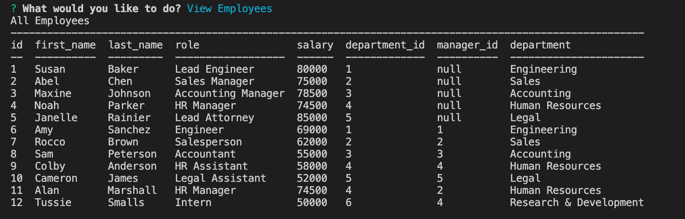
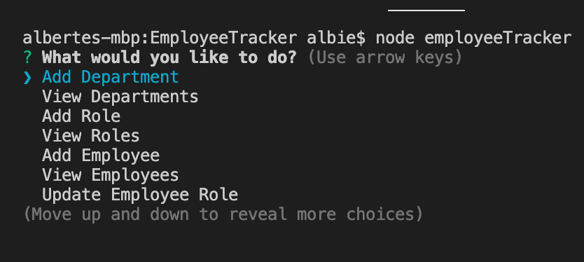

# EmployeeTracker

## Description
This application provides a simple way for users to view and manage departments, roles, and employees in a company. 
Employee Tracker is ideal for a manager who wants to organize and plan their business using a command line interface.
View this application at this link: https://drive.google.com/file/d/1T9jJYtvTK57q91ykwOmyEbSUtFyjlUHj/view 

## License
[](https://opensource.org/licenses/MIT)


## Images



## Technologies Used
```Node, Inquirer, MySQL```

## Questions
Please contact alberte.laventure@gmail.com with any questions

